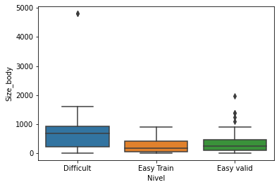
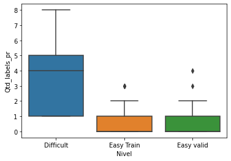

# Mineração de dados do Github 
O objetivo deste trabalho é realizar a mineração de dados no repositório <a href="https://github.com/zulip/zulip">Zulip</a>, para compreender o que faz uma *Issue* ser classificada como difícil.

<h2> Integrantes</h2>

     Alisson             email: alisson.v3@hotmail.com
     Juan                email: juanrangel@alunos.utfpr.edu.br
     Lucas               email: lsantos.2016@alunos.utfpr.edu.br

# Execução
Para o desenvolvimento do projeto foi utilizado a linguagem de programação <a href="https://www.python.org/downloads/">Python</a>, em conjunto com a plataforma de computação interativa <a href="https://jupyter.org/install">Jupyter Notebook</a>.

## Execução dos Notebooks
Divimos todo o processo em duas partes: mineração e análise de dados. Para executar os arquivos, é necessário instalar alguns requisitos através do seguinte comando:

```bash
pip install -r requirements.txt 
```
Logo após a instalação dos requisitos, é necessário abrir o arquivo `mineracao.ipynb` com o Jupyter Notebook, este arquivo conterá as instruções para o uso do token de acesso à API do GitHub. Após a execução do código será gerado um arquivo `.csv`, contendo os dados minerados. <br>

Com tudo isso feito, podemos abrir o arquivo `visualizacao.ipynb` com o Jupyter Notebook, no qual conterá as visualizações e resultados obtidos através dos testes estátisticos para os atributos da base dos dados minerados.

# Metodologia
Utilizamos o módulo `PyGithub` para mineração dos dados de *Pull Requests* fáceis e difíceis do repositório Zulip. Como há mais *Pull Requests* fáceis do que dificeis, optamos por separar as fáceis em dois conjuntos de mesmo tamanho das dificeis, os quais foram chamados de conjunto de treino e validação. <br>

A partir desses conjuntos utilizamos técnicas estatísticas para analisar cada atributo com o teste Mann Whitney (p-value), e o valor de Effect Size (d), além de utilizar *boxplots* para uma melhor visualização dos dados. 

# Resultados Obtidos
Após a analise de cada um dos atributos, dois resultados em específico chamaram a nossa atenção, sendo eles o atributo `Size Body`, que representa quantidade de caracteres no corpo de uma *Pull Request*, e a `Qtde Label`, que representa o número de *labels* atribuídas a *Pull Request*. Abaixo podemos observar o *boxplot* de ambos os atributos.

<p align="center">
    
</p>

<p align="center">
    
</p>

Ambos rejeitaram a hipótese nula, ou seja, são estatísticamente diferentes, tanto para os dados de treino, quanto para os dados de validação, e ambos apresentam um alto índice do valor de effect size, ou seja, estes atributos apresentam uma maior significância em relação aos demais atributos analisados, como a quantidade de importações nos arquivos modificados, e a quantidade de comentários nas *Pull Requests*, por exemplo.

# Conclusão
Como é possível observar nos resultados obtidos, as variáveis de maior significância nos dados analisados são associadas aos *Pull Requests*, e não à uma *Issue*, ou seja, podemos concluir que há uma relação entre a definição de dificuldade e uma *Pull Request*, e não a uma *Issue*, já que os atributos associados as *Issues* não possuem grande significância nos dados analisados. Outro aspecto a ser observado é que, de acordo com a análise realizada nos módulos importados dos arquivos modificados, chegamos a conclusão de que no caso deste repositório a quantidade de módulos importados em uma *Pull Request* não possui relação com a sua dificuldade ou com a dificuldade das *Issues* relacionadas.
